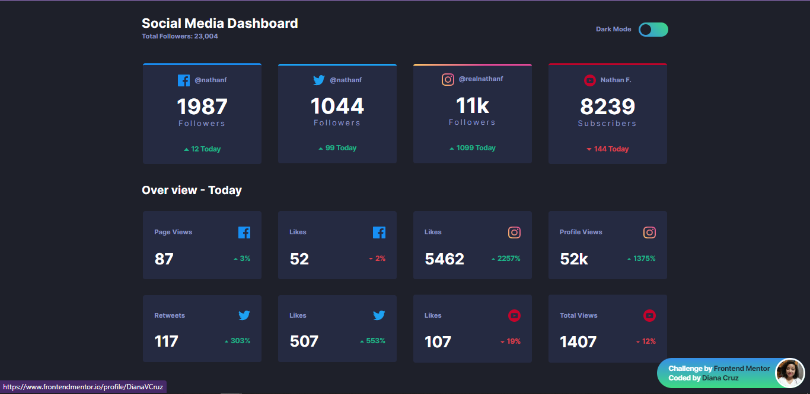
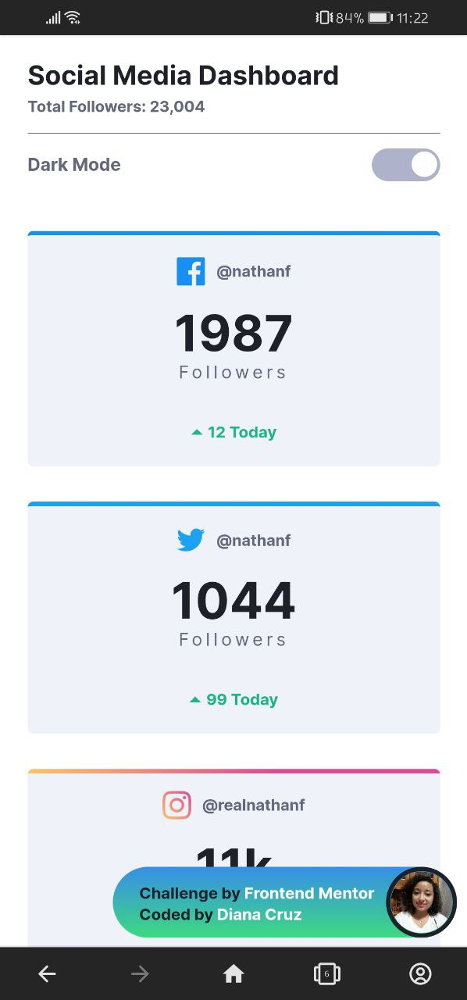

# Frontend Mentor - Social media dashboard with theme switcher solution

This is a solution to the [Social media dashboard with theme switcher challenge on Frontend Mentor](https://www.frontendmentor.io/challenges/social-media-dashboard-with-theme-switcher-6oY8ozp_H).

## Table of contents

- [Overview](#overview)
  - [The challenge](#the-challenge)
  - [Screenshot](#screenshot)
  - [Links](#links)
- [My process](#my-process)
  - [Built with](#built-with)
  - [What I learned](#what-i-learned)
  - [Continued development](#continued-development)
  - [Useful resources](#useful-resources)
- [Author](#author)

## Overview

### The challenge

I should be able to:

- View the optimal layout for the site depending on their device's screen size
- See hover states for all interactive elements on the page
- Toggle color theme to their preference

### Screenshot

### Links

- Solution URL: [Github.com](https://github.com/dianacruzpro/fem-social-media-dashboard)
- Live Site URL: [Netlify.com](https://your-live-site-url.com)

## My process

### Built with

- Semantic HTML5 markup
- CSS custom properties
- SCSS styles
- Flexbox
- CSS Grid
- Mobile-first workflow

## Author

- Website - [dianacruz.pro](https://dianacruz.pro)
- Frontend Mentor - [@DianaVCruz](https://www.frontendmentor.io/profile/DianaVCruz)
- Twitter - [@dianacruzpro](https://www.twitter.com/dianacruzpro)

## Acknowledgments

Without a doubt 😁☝, working the styles by components make your workflow faster 😲 and even better, if you add the gulpfile 🥤 to your tools, perform your repetitive tasks automatically to test your sites 😍⚡

